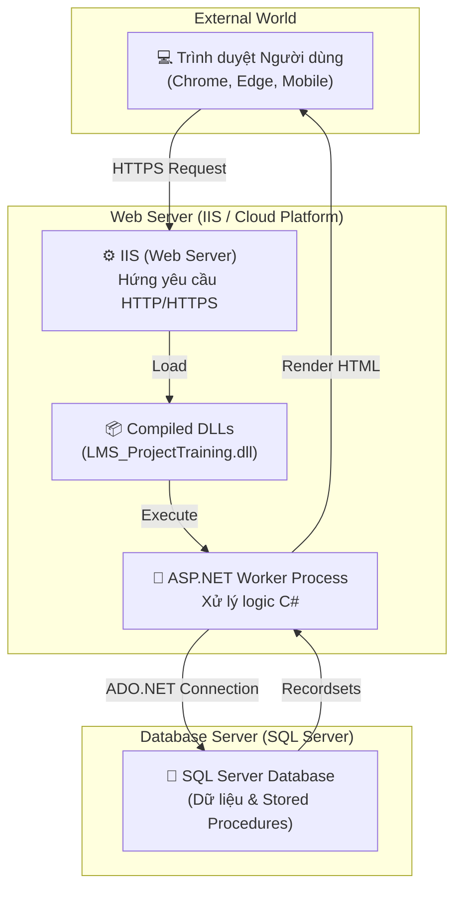

# 📖 GIẢI THÍCH CHI TIẾT CODE - Dự án LMS (Library Management System)

## 📋 Mục lục

1. [Tổng quan kiến trúc](#1-tổng-quan-kiến-trúc)
   - [1.1 Kiến trúc khi triển khai (Deployment Architecture)](#11-kiến-trúc-khi-triển-khai-deployment-architecture)
2. [Công nghệ sử dụng](#2-công-nghệ-sử-dụng)
3. [Cấu trúc file ASP.NET Web Forms](#3-cấu-trúc-file-aspnet-web-forms)
4. [Giải thích từng file](#4-giải-thích-từng-file)
   - [4.1 File cấu hình gốc](#41-file-cấu-hình-gốc)
   - [4.2 Lớp kết nối Database](#42-lớp-kết-nối-database---dbconnectcs)
   - [4.3 Trang Master (Layout)](#43-trang-master-layout)
   - [4.4 Trang công khai](#44-trang-công-khai-không-cần-đăng-nhập)
   - [4.5 Trang Admin](#45-trang-admin-cần-đăng-nhập-admin)
   - [4.6 Trang User](#46-trang-user-cần-đăng-nhập-user)
5. [Cơ sở dữ liệu](#5-cơ-sở-dữ-liệu)
6. [Luồng hoạt động](#6-luồng-hoạt-động)
7. [Hướng dẫn Deploy lên Somee.com](#7-hướng-dẫn-deploy-lên-someecom)

---

## 1. Tổng quan kiến trúc

Dự án sử dụng kiến trúc **ASP.NET Web Forms** theo mô hình **3 lớp đơn giản**:

```
┌──────────────────────────────────────────────────────────────┐
│                    TRÌNH DUYỆT (Browser)                     │
│         Người dùng truy cập qua http://localhost:xxxx        │
└──────────────────────┬───────────────────────────────────────┘
                       │ HTTP Request/Response
┌──────────────────────▼───────────────────────────────────────┐
│                  TẦNG GIAO DIỆN (Presentation Layer)         │
│                                                              │
│  ┌─────────────────┐  ┌──────────────────┐  ┌────────────┐  │
│  │  Master Pages   │  │  Content Pages   │  │ Code-Behind│  │
│  │  (.Master)      │  │  (.aspx)         │  │ (.aspx.cs) │  │
│  │  - Layout chung │  │  - Giao diện     │  │ - Xử lý    │  │
│  │  - Navbar       │  │  - Form nhập     │  │   logic    │  │
│  │  - Footer       │  │  - Hiển thị data │  │   server   │  │
│  └─────────────────┘  └──────────────────┘  └────────────┘  │
└──────────────────────┬───────────────────────────────────────┘
                       │ Gọi phương thức
┌──────────────────────▼───────────────────────────────────────┐
│                  TẦNG TRUY CẬP DỮ LIỆU (Data Access Layer)  │
│                                                              │
│  ┌──────────────────────────────────────────────────────┐    │
│  │  DBConnect.cs                                        │    │
│  │  - Mở/đóng kết nối SQL Server                       │    │
│  │  - Thực thi truy vấn SELECT (Load_Data)              │    │
│  │  - Thực thi INSERT/UPDATE/DELETE (InsertUpdateData)  │    │
│  └──────────────────────────────────────────────────────┘    │
└──────────────────────┬───────────────────────────────────────┘
                       │ ADO.NET (SqlConnection, SqlCommand)
┌──────────────────────▼───────────────────────────────────────┐
│                  CƠ SỞ DỮ LIỆU (SQL Server)                 │
│                                                              │
│  Database: ELibraryDB_Project001                             │
│  - 7 bảng (member, admin, book, author, publisher, ...)     │
│  - 20+ Stored Procedures                                    │
└──────────────────────────────────────────────────────────────┘
```

---

### 1.1 Kiến trúc khi triển khai (Deployment Architecture)

Khi bạn đưa trang web này lên một máy chủ thực tế (Deploy) để người dùng khắp nơi có thể truy cập, mô hình hoạt động sẽ như sau:



**Các thành phần chính:**
1.  **Client (Trình duyệt):** Gửi các yêu cầu (Request) lên Server qua giao thức HTTP/HTTPS. Giao diện lúc này chỉ là HTML/CSS/JS thuần túy.
2.  **Web Server (IIS):** Tiếp nhận yêu cầu, tải các file đã được biên dịch (file `.dll` trong thư mục `bin`) và vận hành chúng.
3.  **ASP.NET Worker Process:** Thực thi logic C# từ code-behind. Đây là nơi các Stored Procedures được gọi và dữ liệu được xử lý.
4.  **Database Server:** Lưu trữ toàn bộ dữ liệu. Kết nối với Web Server thông qua **Connection String** trong `Web.config`.

---

## 2. Công nghệ sử dụng

| Công nghệ | Vai trò | Giải thích |
|---|---|---|
| **ASP.NET Web Forms** | Framework chính | Framework nền tảng của Microsoft. Sử dụng mô hình xử lý Sự kiện (Event-driven) mạnh mẽ. |
| **C# (.NET 4.7.2)** | Ngôn ngữ Backend | Xử lý toàn bộ logic nghiệp vụ, bảo mật và tương tác dữ liệu phía máy chủ. |
| **SQL Server Express** | Cơ sở dữ liệu | Lưu trữ dữ liệu tập trung. Sử dụng **Stored Procedures** để tối ưu hóa hiệu suất và bảo mật. |
| **ADO.NET** | Giao tiếp dữ liệu | Thư viện kết nối Database tiêu chuẩn (SqlConnection, SqlCommand, SqlDataAdapter). |
| **Master Pages** | Quản lý Layout | Giúp đồng bộ giao diện (Header, Footer, Navbar) cho toàn bộ ứng dụng một cách chuyên nghiệp. |
| **Bootstrap 4** | CSS Framework | Đảm bảo giao diện hiện đại, chuyên nghiệp và hiển thị tốt trên mọi thiết bị (Responsive). |
| **jQuery 3.3.1** | Thư viện JS | Phụ trách các tương tác động phía trình duyệt và hỗ trợ các Plugin Frontend. |
| **DataTables** | GridView nâng cao | Hỗ trợ tìm kiếm, phân trang và sắp xếp dữ liệu cực nhanh ngay trên giao diện người dùng. |
| **Font Awesome 5** | Hệ thống Icon | Cung cấp bộ biểu tượng đồ họa chuyên nghiệp (User, Admin, Home...). |
| **SweetAlert** | Thông báo popup | Thay thế các thông báo mặc định bằng các hộp thoại hiện đại, tinh tế và thân thiện. |
| **IIS Express** | Web Server | Máy chủ chạy ứng dụng web tích hợp chuyên dùng cho quá trình phát triển dự án. |

---

## 3. Cấu trúc file ASP.NET Web Forms

Mỗi trang web trong ASP.NET Web Forms gồm **3 file**:

```
TenTrang.aspx              ← Giao diện HTML + ASP.NET controls
TenTrang.aspx.cs           ← Code-behind (C#) - Xử lý logic server
TenTrang.aspx.designer.cs  ← Auto-generated - Khai báo biến cho controls
```

**Ví dụ cho trang Login:**
- `Login.aspx` → HTML form đăng nhập (TextBox, Button...)
- `Login.aspx.cs` → Code C# xử lý khi nhấn nút Login (kiểm tra DB, tạo Session...)
- `Login.aspx.designer.cs` → Visual Studio tự sinh, khai báo biến `txtMemberID`, `txtPassword`, `btnLogin`...

### Master Page (.Master)

Master Page là **layout chung** được dùng lại cho nhiều trang. Nó chứa:
- Navbar (thanh điều hướng)
- Header
- Footer
- `<asp:ContentPlaceHolder>` → Vị trí để trang con chèn nội dung

Trang con sử dụng Master Page bằng directive:
```aspx
<%@ Page MasterPageFile="~/Site1.Master" %>
```

---

## 4. Giải thích từng file

---

### 4.1 File cấu hình gốc

#### 📄 `LMS_ProjectTraining.sln` — Solution File
```
Mục đích: File chính để mở dự án trong Visual Studio
Visual Studio đọc file này để biết dự án nào cần load, cấu hình build...
→ Luôn mở file .sln chứ không phải .csproj
```

#### 📄 `LMS_ProjectTraining.csproj` — Project File
```
Mục đích: Cấu hình chi tiết dự án
Nội dung quan trọng:
  - TargetFrameworkVersion: v4.7.2 (phiên bản .NET Framework)
  - References: các thư viện DLL được tham chiếu (System.Web, System.Data, ...)
  - Content/Compile: danh sách tất cả file trong dự án
  - NuGet Import: đường dẫn tới package Microsoft.CodeDom
```

#### 📄 `Web.config` — Cấu hình ứng dụng web
```csharp
// Đường dẫn: /Web.config
// Mục đích: Cấu hình toàn bộ ứng dụng ASP.NET

<appSettings>
    // Tắt Unobtrusive Validation (dùng validation kiểu cũ)
    <add key="ValidationSettings:UnobtrusiveValidationMode" value="None" />
</appSettings>

<connectionStrings>
    // Chuỗi kết nối SQL Server
    // "cn" là tên connection, được dùng trong DBConnect.cs
    // Data Source = tên SQL Server instance
    // Initial Catalog = tên database
    // Integrated Security = dùng Windows Authentication
    <add name="cn" connectionString="Data Source=TÊN_MÁY\SQLEXPRESS;
         Initial Catalog=ELibraryDB_Project001;Integrated Security=true" />
</connectionStrings>

<system.web>
    // Bật debug mode, target .NET 4.7.2
    // maxRequestLength: Giới hạn dung lượng tải lên (102400 KB = 100 MB)
    <compilation debug="true" targetFramework="4.7.2" />
    <httpRuntime targetFramework="4.7.2" maxRequestLength="102400" />
</system.web>

<system.webServer>
    <security>
        <requestFiltering>
            // maxAllowedContentLength: Giới hạn dung lượng request (104857600 Bytes = 100 MB)
            <requestLimits maxAllowedContentLength="104857600" />
        </requestFiltering>
    </security>
</system.webServer>
```

#### 📄 `Global.asax` + `Global.asax.cs` — Application Lifecycle
```csharp
// Đường dẫn: /Global.asax.cs
// Mục đích: Xử lý sự kiện cấp ứng dụng (Application-level events)

public class Global : System.Web.HttpApplication
{
    protected void Application_Start(object sender, EventArgs e)
    {
        // Chạy 1 lần khi ứng dụng khởi động
        // Hiện tại để trống
    }

    protected void Application_Error(object sender, EventArgs e)
    {
        // Chạy khi có exception KHÔNG được xử lý
        // Bắt lỗi → Redirect tới trang ErrorPage.aspx với thông báo lỗi
        Exception ex = Server.GetLastError();
        Server.ClearError();  // Xóa lỗi để không hiện Yellow Screen of Death

        if (ex.InnerException != null)
            Response.Redirect("~/ErrorPage.aspx?ErrorMessage=" + ex.InnerException.Message);
        else
            Response.Redirect("~/ErrorPage.aspx?ErrorMessage=" + ex.Message);
    }
}
```

#### 📄 `packages.config` — Danh sách NuGet packages
```xml
<!-- Liệt kê các NuGet package dự án cần -->
<packages>
    <!-- Microsoft.CodeDom.Providers.DotNetCompilerPlatform v2.0.1 -->
    <!-- Cung cấp Roslyn compiler cho ASP.NET Web Forms -->
    <!-- Cho phép dùng cú pháp C# mới (6.0+) trong Web Forms -->
    <package id="Microsoft.CodeDom.Providers.DotNetCompilerPlatform"
             version="2.0.1" targetFramework="net472" />
</packages>
```

---

### 4.2 Lớp kết nối Database - `DBConnect.cs`

```csharp
// Đường dẫn: /DBConnect.cs
// Mục đích: Lớp trung tâm quản lý kết nối và thao tác với SQL Server
// Tất cả các trang đều dùng class này để truy cập database

public class DBConnect
{
    // ═══════════════════════════════════════════════════
    // 1. KHỞI TẠO KẾT NỐI
    // Đọc connection string "cn" từ Web.config
    // Tạo SqlConnection object để kết nối SQL Server
    // ═══════════════════════════════════════════════════
    private SqlConnection con = new SqlConnection(
        ConfigurationManager.ConnectionStrings["cn"].ConnectionString
    );

    // Trả về đối tượng SqlConnection để các trang khác dùng
    public SqlConnection GetCon() { return con; }

    // ═══════════════════════════════════════════════════
    // 2. MỞ KẾT NỐI
    // Chỉ mở nếu đang đóng (tránh lỗi "Connection already open")
    // ═══════════════════════════════════════════════════
    public void OpenCon()
    {
        if (con.State == ConnectionState.Closed)
            con.Open();
    }

    // ═══════════════════════════════════════════════════
    // 3. ĐÓNG KẾT NỐI
    // Chỉ đóng nếu đang mở (tránh lỗi)
    // ═══════════════════════════════════════════════════
    public void CloseCon()
    {
        if (con.State == ConnectionState.Open)
            con.Close();
    }

    // ═══════════════════════════════════════════════════
    // 4. TRUY VẤN DỮ LIỆU (SELECT)
    // Dùng cho các câu lệnh trả về dữ liệu (SELECT)
    // Trả về DataTable chứa kết quả
    // ═══════════════════════════════════════════════════
    public DataTable Load_Data(SqlCommand cmd)
    {
        SqlDataAdapter da = new SqlDataAdapter(cmd);  // Adapter để fill data
        DataTable dt = new DataTable();                // Bảng chứa kết quả
        try
        {
            da.Fill(dt);    // Tự mở connection, chạy query, fill data, đóng connection
            return dt;
        }
        catch { throw; }    // Nếu lỗi → ném lại exception
        finally
        {
            dt.Dispose();   // Giải phóng bộ nhớ
            da.Dispose();
            CloseCon();     // Đảm bảo đóng connection
        }
    }

    // ═══════════════════════════════════════════════════
    // 5. THỰC THI LỆNH (INSERT/UPDATE/DELETE)
    // Dùng cho các câu lệnh không trả về dữ liệu
    // Trả về true nếu thành công, false nếu thất bại
    // ═══════════════════════════════════════════════════
    public Boolean InsertUpdateData(SqlCommand cmd)
    {
        bool recordSaved;
        try
        {
            OpenCon();              // Mở kết nối
            cmd.ExecuteNonQuery();  // Thực thi INSERT/UPDATE/DELETE
            recordSaved = true;     // Thành công
        }
        catch
        {
            recordSaved = false;    // Thất bại (nuốt exception)
        }
        finally
        {
            CloseCon();             // Luôn đóng connection
        }
        return recordSaved;
    }
}
```

**Cách sử dụng trong các trang:**
```csharp
DBConnect dbcon = new DBConnect();  // Tạo instance

// SELECT
SqlCommand cmd = new SqlCommand("SELECT * FROM book_master_tbl", dbcon.GetCon());
DataTable dt = dbcon.Load_Data(cmd);

// INSERT/UPDATE/DELETE
SqlCommand cmd = new SqlCommand("sp_InsertSignup", dbcon.GetCon());
cmd.CommandType = CommandType.StoredProcedure;
cmd.Parameters.AddWithValue("@full_name", "Nguyễn Văn A");
bool success = dbcon.InsertUpdateData(cmd);
```

---

### 4.3 Trang Master (Layout)

#### 📄 `Site1.Master` — Layout trang công khai

```html
<!-- Đường dẫn: /Site1.Master -->
<!-- Mục đích: Layout chung cho các trang KHÔNG cần đăng nhập -->
<!-- Sử dụng bởi: default.aspx -->

<!-- PHẦN HEAD: Load CSS/JS -->
<head>
    <title>Library</title>
    <link href="bootstrap/css/bootstrap.min.css" />    <!-- Bootstrap CSS -->
    <link href="datatable/css/jquery.dataTables.min.css" /> <!-- DataTables CSS -->
    <link href="fontawesome/css/all.css" />            <!-- Font Awesome icons -->
    <script src="bootstrap/js/jquery-3.3.1.slim.min.js"></script>  <!-- jQuery -->
    <script src="bootstrap/js/popper.min.js"></script>             <!-- Popper.js -->
    <script src="bootstrap/js/bootstrap.min.js"></script>          <!-- Bootstrap JS -->

    <!-- Vị trí để trang con chèn thêm CSS/JS riêng -->
    <asp:ContentPlaceHolder ID="head" runat="server" />
</head>

<!-- PHẦN BODY -->
<body>
    <!-- 1. NAVBAR: Thanh điều hướng trên cùng -->
    <nav class="navbar navbar-dark bg-primary">
        <!-- Logo + Tên ứng dụng -->
        <a class="navbar-brand" href="default.aspx">LMS Application</a>

        <!-- Menu items: Home, Library Collection, Archives, Publications, Gallery, Contact -->
        <ul class="navbar-nav">...</ul>

        <!-- Nút Sign Up + Sign In (góc phải) -->
        <div class="pmd-navbar-right-icon">
            <a href="SignUp.aspx">Sign Up</a>
            <a href="Login.aspx">Sign In</a>
        </div>
    </nav>

    <!-- 2. HEADER: Banner lớn phía trên -->
    <div class="jumbotron">
        <h1>Library Management System</h1>
        <p>Building community. Inspiring readers. Expanding book access!</p>
    </div>

    <!-- 3. NỘI DUNG CHÍNH: 2 cột -->
    <div class="container-fluid">
        <div class="row">
            <!-- Cột trái (2/12): Sidebar Filter -->
            <div class="col-sm-2">Filter, Top Search, Links...</div>

            <!-- Cột phải (10/12): NỘI DUNG TRANG CON sẽ được chèn vào đây -->
            <div class="col-sm-10">
                <asp:ContentPlaceHolder ID="ContentPlaceHolder1" runat="server" />
                <!-- ↑↑↑ Trang con (default.aspx) sẽ chèn nội dung vào đây -->
            </div>
        </div>
    </div>

    <!-- 4. FOOTER -->
    <div class="jumbotron alert-danger">
        Heading1, Payment Center, Website, Follow Us (Facebook), Copyright
    </div>
</body>
```

#### 📄 `Admin/AdminSite.Master` — Layout trang Admin

```
Tương tự Site1.Master nhưng khác:
- Navbar màu DARK (bg-dark) thay vì PRIMARY (bg-primary)
- Menu Admin: Home, Add Author, Publisher, Member, Book Inventory,
              Issue/Return, ViewBook, Report, Fine
- Hiển thị TÊN ADMIN đang đăng nhập (lblUserName)
- Nút Sign Out thay vì Sign Up/Sign In
- Không có sidebar Filter
- Nội dung chiếm 12 cột (full width)
```

#### 📄 `UserScreen/User.Master` — Layout trang User
```
Tương tự AdminSite.Master nhưng:
- Menu User: Home, ViewBook, My Profile, Report, Payment
- Hiển thị TÊN USER đang đăng nhập
- Nút Sign Out
```

---

### 4.4 Trang công khai (Không cần đăng nhập)

#### 📄 `default.aspx` + `default.aspx.cs` — Trang chủ

```html
<!-- default.aspx -->
<!-- Sử dụng Master Page: Site1.Master -->
<%@ Page MasterPageFile="~/Site1.Master" %>

<!-- NỘI DUNG chèn vào ContentPlaceHolder1 của Master Page -->
<asp:Content ContentPlaceHolderID="ContentPlaceHolder1">

    <!-- 1. IMAGE CAROUSEL (Slideshow) -->
    <!-- Dùng Bootstrap Carousel, 3 ảnh: lms1.png, lms2.jpg, lms3.jpg -->
    <div id="demo" class="carousel slide" data-ride="carousel">
        <ul class="carousel-indicators">...</ul>
        <div class="carousel-inner">
            <div class="carousel-item active">
                
            </div>
            <!-- thêm 2 slide nữa -->
        </div>
    </div>

    <!-- 2. BÀI VIẾT MẪU -->
    <h2>TITLE HEADING</h2>
    <p>Nội dung mẫu Lorem ipsum...</p>

    <!-- 3. CARDS "BLACK FRIDAY DEAL" -->
    <!-- 3 card sản phẩm mẫu (placeholder images) -->

</asp:Content>
```

```csharp
// default.aspx.cs — Code-behind (rất đơn giản)
public partial class _default : System.Web.UI.Page
{
    protected void Page_Load(object sender, EventArgs e)
    {
        // Không có logic gì — trang chủ tĩnh
    }
}
```

---

#### 📄 `Login.aspx` + `Login.aspx.cs` — Trang đăng nhập

```html
<!-- Login.aspx -->
<!-- KHÔNG dùng Master Page — tự tạo layout riêng (copy navbar, sidebar, footer) -->

<!-- 2 TAB đăng nhập (Bootstrap Tabs) -->
<ul class="nav nav-tabs">
    <li><a href="#home">User Login</a></li>      <!-- Tab 1 -->
    <li><a href="#menu1">Admin Login</a></li>     <!-- Tab 2 -->
</ul>

<!-- TAB 1: USER LOGIN -->
<div id="home">
                     <!-- Ảnh đại diện user -->
    <asp:TextBox ID="txtMemberID" />               <!-- Ô nhập Member ID -->
    <asp:TextBox ID="txtPassword" TextMode="Password" />  <!-- Ô nhập mật khẩu -->
    <asp:Button ID="btnLogin" Text="Login"
                OnClick="btnLogin_Click" />         <!-- Nút Login → gọi hàm C# -->
    <a href="SignUp.aspx">Sign Up</a>              <!-- Link tới trang đăng ký -->
</div>

<!-- TAB 2: ADMIN LOGIN -->
<div id="menu1">
    
    <asp:TextBox ID="txtAdminID" />
    <asp:TextBox ID="txtAdminPass" TextMode="Password" />
    <asp:Button ID="btnAdminLogin" Text="Admin Login"
                OnClick="btnAdminLogin_Click" />
</div>
```

```csharp
// Login.aspx.cs — Logic đăng nhập

public partial class Login : System.Web.UI.Page
{
    DBConnect dbcon = new DBConnect();  // Kết nối database

    // ═══════════════════════════════════════════════
    // XỬ LÝ ĐĂNG NHẬP USER
    // Gọi khi nhấn nút "Login" ở tab User Login
    // ═══════════════════════════════════════════════
    protected void btnLogin_Click(object sender, EventArgs e)
    {
        // 1. Tạo SqlCommand gọi stored procedure "sp_UserLogin"
        SqlCommand cmd = new SqlCommand("sp_UserLogin", dbcon.GetCon());
        dbcon.OpenCon();
        cmd.CommandType = CommandType.StoredProcedure;

        // 2. Truyền tham số: member_id và password từ form
        cmd.Parameters.AddWithValue("@member_id", txtMemberID.Text);
        cmd.Parameters.AddWithValue("@password", txtPassword.Text);

        // 3. Thực thi và đọc kết quả
        SqlDataReader dr = cmd.ExecuteReader();

        if (dr.HasRows)  // Nếu tìm thấy user phù hợp
        {
            while (dr.Read())
            {
                // 4. Lưu thông tin user vào SESSION
                // Session là bộ nhớ phía server, lưu thông tin giữa các request
                Session["role"] = "user";
                Session["fullname"] = dr.GetValue(0).ToString();  // Cột 1: full_name
                Session["username"] = dr.GetValue(1).ToString();  // Cột 2: member_id
                Session["status"] = dr.GetValue(3).ToString();    // Cột 4: account_status
                Session["mid"] = txtMemberID.Text;                // Member ID
            }

            // 5. Chuyển hướng tới trang Dashboard User
            Response.Redirect("~/UserScreen/UserHome.aspx");
        }
        else  // Sai thông tin đăng nhập
        {
            // Hiển thị SweetAlert popup "Error"
            ClientScript.RegisterClientScriptBlock(this.GetType(), "alert",
                "swal('Error','Error! Invalid credentials...try again','error')", true);
        }
    }

    // ═══════════════════════════════════════════════
    // XỬ LÝ ĐĂNG NHẬP ADMIN
    // Tương tự User Login nhưng dùng sp_AdminLogin
    // ═══════════════════════════════════════════════
    protected void btnAdminLogin_Click(object sender, EventArgs e)
    {
        SqlCommand cmd = new SqlCommand("sp_AdminLogin", dbcon.GetCon());
        // ... (tương tự btnLogin_Click)
        // Khác: Session["Adminrole"] = "Admin", Session["Adminusername"], Session["Adminfullname"]
        // Redirect tới: ~/Admin/AdminHome.aspx
    }
}
```

---

#### 📄 `SignUp.aspx` + `SignUp.aspx.cs` — Trang đăng ký

```csharp
// SignUp.aspx.cs — Logic đăng ký tài khoản

public partial class SignUp : System.Web.UI.Page
{
    // ═══════════════════════════════════════════════
    // PAGE_LOAD: Chạy mỗi khi trang được tải
    // ═══════════════════════════════════════════════
    protected void Page_Load(object sender, EventArgs e)
    {
        if (!IsPostBack)   // Chỉ chạy lần đầu (không chạy khi submit form)
        {
            Autogenrate();  // Tự sinh Member ID tiếp theo
        }
    }

    // ═══════════════════════════════════════════════
    // TỰ SINH MEMBER ID
    // Lấy MAX(member_id) từ DB, cộng thêm 1
    // Nếu chưa có ai → bắt đầu từ 1001
    // ═══════════════════════════════════════════════
    public void Autogenrate()
    {
        cmd = new SqlCommand("select max(member_id) as ID from member_master_tbl", dbcon.GetCon());
        dbcon.OpenCon();
        SqlDataReader dr = cmd.ExecuteReader();
        if (dr.Read())
        {
            string d = dr[0].ToString();
            if (d == "")
                txtMemberID.Text = "1001";     // Nếu bảng trống → ID đầu tiên = 1001
            else
            {
                int r = Convert.ToInt32(d);
                txtMemberID.Text = (r + 1).ToString();  // ID mới = ID cũ + 1
            }
        }
        dbcon.CloseCon();
    }

    // ═══════════════════════════════════════════════
    // NÚT SIGN UP
    // ═══════════════════════════════════════════════
    protected void btnSignup_Click(object sender, EventArgs e)
    {
        // 1. Kiểm tra trùng Member ID hoặc Email
        if (checkDuplicationMemberExist())
        {
            // Đã tồn tại → thông báo lỗi
            Response.Write("<script>alert('Member already exist with this ID and email');</script>");
        }
        else
        {
            // 2. Không trùng → tạo tài khoản
            createAccount();
        }
    }

    // ═══════════════════════════════════════════════
    // TẠO TÀI KHOẢN
    // Gọi SP sp_InsertSignup với 11 tham số
    // account_status mặc định = "pending" (cần Admin duyệt)
    // ═══════════════════════════════════════════════
    private void createAccount()
    {
        dbcon.OpenCon();
        cmd = new SqlCommand("sp_InsertSignup", dbcon.GetCon());
        cmd.CommandType = CommandType.StoredProcedure;
        cmd.Parameters.AddWithValue("@full_name", txtFullName.Text);
        cmd.Parameters.AddWithValue("@dob", txtDOB.Text);
        // ... (các tham số khác)
        cmd.Parameters.AddWithValue("@account_status", "pending");  // ← Mặc định pending

        if (cmd.ExecuteNonQuery() == 1)  // 1 dòng được insert
        {
            // Thông báo thành công bằng SweetAlert
            ClientScript.RegisterClientScriptBlock(this.GetType(), "alert",
                "swal('Success','Account created successfully','success')", true);
            clrcontrol();     // Xóa trắng form
            Autogenrate();    // Sinh ID mới
        }
    }

    // ═══════════════════════════════════════════════
    // KIỂM TRA TRÙNG (member_id hoặc email)
    // ═══════════════════════════════════════════════
    protected bool checkDuplicationMemberExist()
    {
        cmd = new SqlCommand("sp_CheckDuplicateMember", dbcon.GetCon());
        cmd.CommandType = CommandType.StoredProcedure;
        cmd.Parameters.AddWithValue("@member_id", txtMemberID.Text.Trim());
        cmd.Parameters.AddWithValue("@email", txtEmail.Text.Trim());
        DataTable dt = new DataTable();
        new SqlDataAdapter(cmd).Fill(dt);
        return dt.Rows.Count >= 1;  // Trả true nếu đã tồn tại
    }

    // ═══════════════════════════════════════════════
    // XÓA TRẮNG FORM sau khi đăng ký thành công
    // ═══════════════════════════════════════════════
    private void clrcontrol()
    {
        txtFullName.Text = txtAddress.Text = txtCity.Text = ... = String.Empty;
        ddlState.SelectedIndex = 0;
    }
}
```

---

#### 📄 `signout.aspx.cs` — Đăng xuất

```csharp
// signout.aspx.cs — Xóa Session và redirect về trang chủ

protected void Page_Load(object sender, EventArgs e)
{
    // 1. Hủy toàn bộ Session
    Session.Abandon();     // Đánh dấu Session sẽ bị hủy
    Session.Clear();       // Xóa tất cả dữ liệu trong Session

    // 2. Xóa từng Session key cụ thể (User)
    Session.Remove("role");
    Session.Remove("fullname");
    Session.Remove("username");
    Session.Remove("status");

    // 3. Xóa từng Session key cụ thể (Admin)
    Session.Remove("Adminrole");
    Session.Remove("Adminusername");
    Session.Remove("Adminfullname");

    // 4. Redirect về trang chủ
    Response.Redirect("default.aspx");
}
```

---

### 4.5 Trang Admin (Cần đăng nhập Admin)

#### 📄 `Admin/AdminHome.aspx.cs` — Dashboard Admin

```csharp
// AdminHome.aspx.cs — Trang chủ Admin (Dashboard thống kê)

protected void Page_Load(object sender, EventArgs e)
{
    // ═══════════════════════════════════════════════
    // KIỂM TRA QUYỀN ADMIN
    // Nếu Session["Adminrole"] không phải "Admin" → đá ra signout.aspx
    // ═══════════════════════════════════════════════
    if (Session["Adminrole"] != null && Session["Adminrole"].ToString() == "Admin")
    {
        if (Session["Adminusername"].ToString() == "" || Session["Adminusername"] == null)
        {
            Response.Write("<script>alert('Session Expired Login Again');</script>");
            Response.Redirect("~/signout.aspx");
        }
        else
        {
            if (!this.IsPostBack)
            {
                GetIssueBook();    // Đếm tổng sách đang được mượn
                GetTotalBook();    // Đếm tổng sách trong thư viện
                Gettotalfine();    // Tính tổng tiền phạt
            }
        }
    }
    else
    {
        Response.Redirect("~/signout.aspx");  // Không phải Admin → đăng xuất
    }
}

// ═══════════════════════════════════════════════
// 3 HÀM THỐNG KÊ
// ═══════════════════════════════════════════════

// Đếm tổng sách đang mượn
private void GetIssueBook()
{
    // SQL: SELECT COUNT(*) AS Issubook FROM book_issue_tbl
    // → Gán kết quả vào Label lblIssuebook
}

// Đếm tổng sách trong thư viện
private void GetTotalBook()
{
    // SQL: SELECT COUNT(*) AS Totalbook FROM book_master_tbl
    // → Gán kết quả vào Label lblTotalbooks
}

// Tính tổng tiền phạt
private void Gettotalfine()
{
    // SQL: SELECT SUM(fineamount) AS tot FROM BookFineRecord
    // → Gán kết quả vào Label lblamount
}
```

---

#### 📄 `Admin/AdminBookInventory.aspx.cs` — Quản lý kho sách (CRUD)

```csharp
// AdminBookInventory.aspx.cs — File PHỨC TẠP NHẤT trong dự án
// Cung cấp đầy đủ chức năng: Thêm/Sửa/Xóa/Tìm kiếm sách

// ═══════════════════════════════════════════════
// PAGE LOAD: Chạy khi trang được tải
// ═══════════════════════════════════════════════
protected void Page_Load(object sender, EventArgs e)
{
    if (!this.IsPostBack)
    {
        Autogenrate();           // Tự sinh Book ID tiếp theo
        Bind_Author_Publisher(); // Load danh sách tác giả + NXB vào dropdown
        BindGridData();          // Load danh sách sách vào GridView
    }
}

// ═══════════════════════════════════════════════
// THÊM SÁCH MỚI (btnAdd_Click)
// ═══════════════════════════════════════════════
protected void btnAdd_Click(object sender, EventArgs e)
{
    if (checkDuplicateBook())  // Kiểm tra Book ID đã tồn tại chưa
    {
        // Đã tồn tại → báo lỗi
        swal('Error','Book Already Exists ...');
    }
    else
    {
        AddBooks();        // Thêm sách mới
        BindGridData();    // Cập nhật lại bảng
    }
}

// ═══════════════════════════════════════════════
// HÀM THÊM SÁCH
// ═══════════════════════════════════════════════
private void AddBooks()
{
    // 1. Lấy genre (thể loại) từ ListBox (cho phép chọn nhiều)
    string genres = "";
    foreach (int i in ListBoxGenre.GetSelectedIndices())
        genres = genres + ListBoxGenre.Items[i] + ",";
    genres = genres.Remove(genres.Length - 1);  // Bỏ dấu phẩy cuối

    // 2. Upload ảnh bìa sách
    string filename = Path.GetFileName(FileUpload1.PostedFile.FileName);
    FileUpload1.SaveAs(Server.MapPath("~/book_img/" + filename));
    string filepath = "~/book_img/" + filename;

    // 3. Gọi Stored Procedure sp_Insert_Up_Del_BookInventory
    cmd = new SqlCommand("sp_Insert_Up_Del_BookInventory", dbcon.GetCon());
    cmd.CommandType = CommandType.StoredProcedure;
    cmd.Parameters.AddWithValue("@StatementType", "Insert");  // ← Loại thao tác
    cmd.Parameters.AddWithValue("@book_id", txtBookID.Text);
    cmd.Parameters.AddWithValue("@book_name", txtBookName.Text);
    // ... (các tham số khác: author, publisher, language, cost, pages, description)
    cmd.Parameters.AddWithValue("@genre", genres);
    cmd.Parameters.AddWithValue("@book_img_link", filepath);

    // 4. Thực thi
    if (dbcon.InsertUpdateData(cmd))
        swal('Success','Books Added Successfully');
    else
        swal('Error','...try again');
}

// ═══════════════════════════════════════════════
// CẬP NHẬT SÁCH (UpdateBooks)
// Tương tự AddBooks nhưng @StatementType = "Update"
// Có logic kiểm tra actual_stock không được < số sách đang cho mượn
// ═══════════════════════════════════════════════

// ═══════════════════════════════════════════════
// XÓA SÁCH (DeleteBooks)
// Gọi SP với @StatementType = "Delete", chỉ cần @book_id
// ═══════════════════════════════════════════════

// ═══════════════════════════════════════════════
// TÌM KIẾM SÁCH (SearchBooks)
// Gọi SP spgetBookBYID → Fill data vào các TextBox, DropDown
// ═══════════════════════════════════════════════

// ═══════════════════════════════════════════════
// LOAD DANH SÁCH SÁCH VÀO GRIDVIEW
// Gọi SP với @StatementType = "Select"
// ═══════════════════════════════════════════════
private void BindGridData()
{
    cmd = new SqlCommand("sp_Insert_Up_Del_BookInventory", dbcon.GetCon());
    cmd.CommandType = CommandType.StoredProcedure;
    cmd.Parameters.AddWithValue("@StatementType", "Select");
    GridView1.DataSource = dbcon.Load_Data(cmd);
    GridView1.DataBind();
}
```

---

#### 📄 `Admin/bookIssueReturn.aspx.cs` — Mượn/Trả sách

```csharp
// bookIssueReturn.aspx.cs — Quản lý việc mượn và trả sách

// ═══════════════════════════════════════════════
// CHO MƯỢN SÁCH (btnIssue_Click)
// ═══════════════════════════════════════════════
protected void btnIssue_Click(object sender, EventArgs e)
{
    // CẢI TIẾN: Phân tách thông báo lỗi rõ ràng
    if (!IsMemberExist())
        swal('Lỗi', 'Mã thành viên không tồn tại', 'error');
    else if (!IsBookInDB())
        swal('Lỗi', 'Mã sách không tồn tại', 'error');
    else if (!IsBookAvailable())
        swal('Lỗi', 'Sách hiện đã hết trong kho', 'error');
    else
    {
        if (IsIssueEntryExist())
            swal('Cảnh báo', 'Thành viên này đã mượn cuốn sách này rồi', 'warning');
        else
        {
            issueBook();       // Mượn sách
            updateBookStock(); // Trừ kho
            BindGridData();
        }
    }
}

// ═══════════════════════════════════════════════
// TRẢ SÁCH (btnReturn_Click)
// ═══════════════════════════════════════════════
protected void btnReturn_Click(object sender, EventArgs e)
{
    if (IsBookExist() && IsMemberExist())
    {
        if (IsIssueEntryExist())  // Phiếu mượn có tồn tại
        {
            // KIỂM TRA QUÁ HẠN
            if (CheckFine())  // Không quá hạn (ngày trả <= ngày hạn)
            {
                ReturnBook();     // Xóa phiếu mượn + tăng current_stock
            }
            else  // QUÁ HẠN → phải đóng phạt trước
            {
                // Redirect tới trang BookFineEntry.aspx để thanh toán phạt
                Response.Redirect("BookFineEntry.aspx?bid=" + txtBookID.Text
                    + "&mid=" + txtMemID.Text
                    + "&day=" + Session["day"].ToString());
            }
        }
    }
}

// ═══════════════════════════════════════════════
// KIỂM TRA QUÁ HẠN (CheckFine)
// Dùng SP sp_GetNumOfDay: tính DATEDIFF(DAY, due_date, GETDATE())
// Nếu kết quả <= 0 → chưa quá hạn → return true (không phạt)
// Nếu kết quả > 0 → quá hạn → return false (cần phạt)
// ═══════════════════════════════════════════════

// ═══════════════════════════════════════════════
// HIGHLIGHT HÀNG QUÁ HẠN trong GridView
// GridView1_RowDataBound: Tự động tô màu đỏ (PaleVioletRed)
// cho các phiếu mượn có due_date < ngày hôm nay
// ═══════════════════════════════════════════════
protected void GridView1_RowDataBound(object sender, GridViewRowEventArgs e)
{
    if (e.Row.RowType == DataControlRowType.DataRow)
    {
        DateTime dt = Convert.ToDateTime(e.Row.Cells[5].Text);  // Cột due_date
        if (DateTime.Today > dt)  // Quá hạn
        {
            e.Row.BackColor = System.Drawing.Color.PaleVioletRed;  // Tô đỏ
        }
    }
}
```

---

#### 📄 `Admin/Addauthor.aspx.cs` — Quản lý tác giả
```
Chức năng: CRUD tác giả (tương tự sách nhưng đơn giản hơn)
- Thêm tác giả mới (sp_InsertAuthor)
- Xóa tác giả (sp_DeleteAuthor)
- Hiển thị danh sách tác giả trong GridView
```

#### 📄 `Admin/Add_publisher.aspx.cs` — Quản lý nhà xuất bản
```
Chức năng: CRUD nhà xuất bản (tương tự tác giả)
- Thêm NXB (sp_InsertPublisher)
- Xóa NXB (sp_DeletePublisher)
```

#### 📄 `Admin/UpdateMemberDetails.aspx.cs` — Quản lý thành viên
```
Chức năng:
- Tìm kiếm thành viên theo ID
- Cập nhật thông tin thành viên
- DUYỆT tài khoản: đổi account_status từ "pending" → "active"
- Vô hiệu hóa tài khoản: đổi thành "deactive"
- Xóa tài khoản
```

#### 📄 `Admin/BookFineEntry.aspx.cs` — Ghi nhận phạt
```
Chức năng:
- Nhận tham số từ URL: book_id, member_id, số ngày quá hạn
- Tính tiền phạt = số ngày quá hạn × đơn giá phạt
- Ghi nhận phạt vào bảng BookFineRecord
- Sau khi đóng phạt → trả sách (ReturnBook)
```

#### 📄 `Admin/ViewBooks.aspx.cs` — Xem sách
```
Chức năng: Hiển thị tất cả sách trong GridView (chỉ đọc, không sửa/xóa)
```

#### 📄 `Admin/Report.aspx.cs` — Báo cáo
```
Chức năng: Hiển thị báo cáo thống kê (danh sách mượn/trả, phạt...)
```

---

### 4.6 Trang User (Cần đăng nhập User)

#### 📄 `UserScreen/UserHome.aspx.cs` — Dashboard User

```csharp
// UserHome.aspx.cs — Trang chủ User
// Tương tự AdminHome nhưng chỉ hiện thống kê CỦA USER HIỆN TẠI

protected void Page_Load(object sender, EventArgs e)
{
    // Kiểm tra Session user (nếu hết hạn → redirect Login)
    if (Session["username"].ToString() == "" || Session["username"] == null)
    {
        Response.Redirect("Login.aspx");  // Session hết hạn
    }
    else
    {
        if (!this.IsPostBack)
        {
            GetIssueBook();   // Số sách USER NÀY đang mượn
            GetTotalBook();   // Tổng sách thư viện
            Gettotalfine();   // Tổng phạt CỦA USER NÀY
        }
    }
}

// KHÁC VỚI ADMIN:
// - GetIssueBook(): WHERE member_id = @mid (chỉ của user hiện tại)
// - Gettotalfine(): WHERE member_id = @mid (chỉ phạt của user hiện tại)
// - GetTotalBook(): Tổng sách toàn thư viện (không lọc)
```

---

#### 📄 `UserScreen/userprofile.aspx.cs` — Hồ sơ cá nhân

```csharp
// userprofile.aspx.cs — Xem và chỉnh sửa thông tin cá nhân

// PAGE LOAD: Load thông tin user từ DB
private void SearchMember()
{
    // Gọi SP sp_getMemberProfileByID với @member_id = Session["mid"]
    // Fill data vào các TextBox: txtFullName, txtDOB, txtContact, txtEmail,...

    // HIỂN THỊ TRẠNG THÁI TÀI KHOẢN bằng Badge màu:
    if (account_status == "active")
        lblStatus → badge-success (xanh lá)
    else if (account_status == "pending")
        lblStatus → badge-warning (vàng)
    else if (account_status == "deactive")
        lblStatus → badge-danger (đỏ)
}

// UPDATE: Cập nhật profile
protected void btnUpdate_Click(object sender, EventArgs e)
{
    // Gọi SP sp_UpdateMember_Profile
    // Nếu txtNewPassword không trống → đổi mật khẩu mới
    // Nếu txtNewPassword trống → giữ mật khẩu cũ
}

// GRIDVIEW: Hiển thị danh sách sách đang mượn của user
// Highlight hàng quá hạn bằng màu PaleVioletRed (giống Admin)
```

---

## 5. Cơ sở dữ liệu

### 5.1 Sơ đồ các bảng

```
┌─────────────────────┐     ┌─────────────────────┐
│   admin_tbl         │     │   author_tbl        │
├─────────────────────┤     ├─────────────────────┤
│ PK username         │     │ PK author_id (Man)  │
│    password         │     │    author_name      │
│    full_name        │     └─────────────────────┘
└─────────────────────┘
                              ┌─────────────────────┐
                              │  publisher_tbl      │
                              ├─────────────────────┤
                              │ PK publisher_id(Man)│
                              │    publisher_name   │
                              └─────────────────────┘

┌─────────────────────┐     ┌─────────────────────────────────┐
│ member_master_tbl   │     │        book_master_tbl          │
├─────────────────────┤     ├─────────────────────────────────┤
│ PK member_id        │     │ PK book_id                     │
│    full_name        │     │    book_name                   │
│    dob              │     │    author_name                 │
│    contact_no       │     │    publisher_name              │
│    email            │     │    publisher_date, language    │
│    state, city      │     │    edition, book_cost          │
│    pincode          │     │    no_of_pages                 │
│    full_address     │     │    book_description            │
│    password         │     │    genre                       │
│    account_status   │     │    actual_stock                │
│    (pending/active/ │     │    current_stock               │
│     deactive)       │     │    book_img_link               │
└────────┬────────────┘     └──────────┬──────────────────────┘
         │                             │
         │        ┌────────────────────┤
         │        │                    │
    ┌────▼────────▼───────┐    ┌──────▼──────────────────┐
    │  book_issue_tbl     │    │  BookFineRecord         │
    ├─────────────────────┤    ├─────────────────────────┤
    │ PK issue_id (auto)  │    │ PK fine_id (auto)      │
    │ FK book_id          │    │ FK book_id             │
    │ FK member_id        │    │ FK member_id           │
    │    member_name      │    │    member_name         │
    │    book_name        │    │    book_name           │
    │    issue_date       │    │    fineamount          │
    │    due_date         │    │    number_of_day       │
    └─────────────────────┘    │    fine_date           │
                               └─────────────────────────┘
```

### 5.2 Giải thích Stored Procedures chính

| Stored Procedure | Gọi từ file | Chức năng |
|---|---|---|
| `sp_UserLogin` | Login.aspx.cs | Xác thực user: kiểm tra member_id + password + account_status='active' |
| `sp_AdminLogin` | Login.aspx.cs | Xác thực admin: kiểm tra username + password |
| `sp_InsertSignup` | SignUp.aspx.cs | INSERT thành viên mới vào member_master_tbl |
| `sp_CheckDuplicateMember` | SignUp.aspx.cs | Kiểm tra member_id hoặc email đã tồn tại |
| `sp_Insert_Up_Del_BookInventory` | AdminBookInventory | CRUD sách: nhận @StatementType = Insert/Update/Delete/Select/SelectByID |
| `spgetBookBYID` | AdminBookInventory | SELECT sách theo book_id |
| `sp_InsertBookIssue` | bookIssueReturn | INSERT phiếu mượn mới |
| `sp_UpdateIssueBookStock` | bookIssueReturn | Giảm current_stock khi cho mượn |
| `sp_returnBook_Updatestock` | bookIssueReturn | DELETE phiếu mượn + tăng current_stock |
| `sp_GetNumOfDay` | bookIssueReturn | Tính DATEDIFF giữa due_date và ngày hiện tại |
| `sp_checkIssueexistOrnot` | bookIssueReturn | Kiểm tra phiếu mượn tồn tại |
| `sp_getMemberProfileByID` | userprofile | SELECT thông tin thành viên theo ID |
| `sp_UpdateMember_Profile` | userprofile | UPDATE thông tin cá nhân user |
| `sp_GetUserIssueBookDetails` | userprofile | SELECT sách đang mượn của user |
| `sp_InsertAuthor` | Addauthor.aspx.cs | INSERT tác giả mới (hỗ trợ nhập ID thủ công) |
| `sp_InsertPublisher` | Add_publisher.aspx.cs | INSERT NXB mới (hỗ trợ nhập ID thủ công) |
| `spGetAuthor` | AdminBookInventory | SELECT tất cả tác giả |
| `sp_getPublisher` | AdminBookInventory | SELECT tất cả NXB |

---

## 6. Luồng hoạt động

### 6.1 Luồng đăng ký + duyệt tài khoản

```
1. Khách truy cập → SignUp.aspx
2. Điền form → nhấn Sign Up
3. Hệ thống tạo tài khoản (account_status = "pending")
4. Admin đăng nhập → UpdateMemberDetails.aspx
5. Admin tìm thành viên → đổi status thành "active"
6. User mới giờ có thể đăng nhập
```

### 6.2 Luồng mượn sách

```
1. Admin đăng nhập → bookIssueReturn.aspx
2. Nhập Member ID + Book ID → nhấn Search
3. Hệ thống hiện tên thành viên + tên sách
4. Nhập Issue Date + Due Date → nhấn Issue
5. Hệ thống: INSERT vào book_issue_tbl + current_stock - 1
```

### 6.3 Luồng trả sách

```
1. Admin → bookIssueReturn.aspx
2. Nhập Member ID + Book ID → nhấn Return
3. Hệ thống kiểm tra quá hạn:
   a. KHÔNG quá hạn → Xóa phiếu mượn + current_stock + 1
   b. QUÁ HẠN → Redirect tới BookFineEntry.aspx
      → Admin nhập tiền phạt → Ghi nhận phạt → Trả sách
```

### 6.4 Luồng quản lý Session

```
Đăng nhập User:
    Session["role"] = "user"
    Session["fullname"] = tên đầy đủ
    Session["username"] = member_id
    Session["status"] = account_status
    Session["mid"] = member_id

Đăng nhập Admin:
    Session["Adminrole"] = "Admin"
    Session["Adminusername"] = username
    Session["Adminfullname"] = tên đầy đủ

Kiểm tra quyền (mỗi trang Admin):
    if (Session["Adminrole"] != "Admin") → Redirect signout.aspx

Kiểm tra quyền (mỗi trang User):
    if (Session["username"] == "" || null) → Redirect Login.aspx

Đăng xuất:
    Session.Abandon() + Session.Clear() + Remove từng key
    → Redirect default.aspx
```

---

## 📁 Thư mục tài nguyên tĩnh

| Thư mục | Nội dung |
|---|---|
| `bootstrap/` | Bootstrap 4 CSS (`bootstrap.min.css`) + JS (`bootstrap.min.js`, `jquery-3.3.1.slim.min.js`, `popper.min.js`) |
| `datatable/` | DataTables jQuery plugin — CSS + JS cho bảng dữ liệu |
| `fontawesome/` | Font Awesome 6 — Thư viện icon (CSS, JS, SVG, sprites) |
| `SweetAlert/` | SweetAlert library — CSS (`sweetalert.css`) + JS (`sweetalert.min.js`) cho các popup đẹp |
| `LogoImg/` | Ảnh logo, icon user (`user.png`), admin (`admin.png`), sign_up (`sign_up.png`), favicon (`logoIcon.ico`) |
| `SlideImg/` | 3 ảnh cho slideshow trang chủ: `lms1.png`, `lms2.jpg`, `lms3.jpg` |
| `book_img/` | Ảnh bìa sách — upload bởi Admin khi thêm sách mới. Mặc định có `book2.png` |
| `Imgs/` | Ảnh mặc định (placeholder) dùng khi chưa có ảnh bìa |
| `bin/` | Thư mục output — chứa DLL sau khi build (auto-generated) |
| `obj/` | Thư mục build tạm — (auto-generated) |
| `packages/` | NuGet packages đã tải (Microsoft.CodeDom.Providers.DotNetCompilerPlatform) |
| `.vs/` | Visual Studio workspace settings (auto-generated) |
| `Properties/` | Assembly info và project settings |

---

## 7. Hướng dẫn Deploy lên Somee.com

Somee là một nhà cung cấp hosting miễn phí hỗ trợ tốt cho ASP.NET và SQL Server. Khi deploy dự án này lên Somee, bạn cần thực hiện các bước sau:

### 7.1 Chuẩn bị Database
1.  Đăng nhập vào Somee, tạo một **MS SQL Database** mới (phiên bản 2012 hoặc cao hơn).
2.  Sử dụng công cụ **SQL Web Admin** của Somee hoặc **SSMS** để chạy file `setup_database.sql`.
3.  **Lưu ý quan trọng:** Tên database trên Somee sẽ có tiền tố tên tài khoản của bạn (Ví dụ: `nguyenvana.ELibraryDB`). Hãy lưu ý điểm này để điền vào Connection String.

### 7.2 Cập nhật Web.config (Cực kỳ quan trọng)
Bạn cần thay thế nội dung trong thẻ `<connectionStrings>` từ cấu hình Local sang thông số Somee cung cấp:

```xml
<connectionStrings>
    <!-- Ví dụ mẫu Chuỗi kết nối của Somee -->
    <add name="con" connectionString="workstation id=yourDBname.mssql.somee.com;packet size=4096;user id=your_user_id;pwd=your_password;data source=yourDBname.mssql.somee.com;persist security info=False;initial catalog=yourDBname" providerName="System.Data.SqlClient" />
</connectionStrings>
```

### 7.3 Phân quyền cho thư mục Ảnh
Khi chạy trên Hosting, thư mục `book_img` cần có quyền **Write** (Ghi) để Admin có thể thêm ảnh mới cho sách.
*   Vào **File Manager** trên bảng điều khiển của Somee.
*   Tìm thư mục `book_img`.
*   Click vào **Permissions** và đảm bảo quyền **Write** được kích hoạt.

### 7.4 Khắc phục lỗi bảo mật (Trust Level)
Một số server hosting có thể chặn các hoạt động chuyên sâu. Nếu gặp lỗi, hãy thêm dòng này vào trong thẻ `<system.web>` của `Web.config`:
```xml
<trust level="Full" />
```

---

*Tài liệu này giải thích chi tiết code của dự án Library Management System - ASP.NET Web Forms.*
